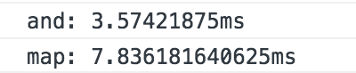

# 位运算是真的妙呀

本次的场景是比较两个rgb颜色的颜色匹配。下标0是Red，1是Green，2是Blue。在后面我会附上本年度我看过的最佳代码。

应用场景是比较所选的颜色和给出的颜色是不是一样，可以用于判断这个人的识色能力？在我们的项目中的应用是颜色检测功能，查看物体是否碰到了指定的颜色。

这个也可以算另一种碰撞功能吧，非常的耗时，首先，你得把舞台上的颜色取下来（该角色区域的）然后逐一和所选的颜色进行比对，如果比对上了，说明碰到了。多么的反人类呐。

如果这个角色的大小是200*200的，那么你就需要比对40000个像素的颜色。何况我们的舞台是960*600，也就是说这个角色再大一点的话。。。

关键比对靠一下cpu的话也就算了，关键是读取的话是需要webgl.readpixels这个方法，非常慢，特别是android对它的优化做的很差，fps狂掉。不过这次不说这些性能问题，只说颜色匹配的与运算。

我们的人眼识别不了那么精细的颜色，所以在做颜色匹配的时候一般是给它一个范围，我们原来的做法是rgb各自多给1度的偏差，也就是27个颜色存在一个对象里，看能不能匹配上。整个做法都看起来非常傻（不针对人），而且只有27个相近色，容差率非常小

    for (let i = r_color - range; i <= r_color + range; i++) {
      for (let j = g_color - range; j <= g_color + range; j++) {
        for (let k = b_color - range; k <= b_color + range; k++) {
          if ((0 <= i && i <= 255) && (0 <= j && j <= 255) && (0 <= k && k <= 255)) {
            const sub_color = rgb_to_hex(i, j, k);
            color_check[sub_color] = true;
          }
        }
      }
    }

但是接下来的代码就非常妙了，按位与，真的妙！我年度看到的最佳代码（也是鄙人才疏学浅）

    (a[0] & 0b11111000) === (b[offset + 0] & 0b11111000) &&
    (a[1] & 0b11111000) === (b[offset + 1] & 0b11111000) &&
    (a[2] & 0b11110000) === (b[offset + 2] & 0b11110000)

而且在这种大量计算下，map是O(1)的查找也非常慢。下面来做一个比较，比较40000次做颜色匹配

基本是在两倍左右的，而且与运算范围很大，还可以放大，不会影响时间。map就不可以了，范围一放大，时间蹭蹭往上走。上述与运算代码的容差范围是2^3*2^3*2^4也就是1024个颜色，对于人眼来说就很够了，人眼分辨不出来的比较接近的颜色也能匹配上。简直高下立判。

我刚开始看到这个代码的时候，叹为观止，整个世界都宏大了起来。虽然我知道与运算，但我不知道在这种情况下它能那么巧妙，那么精致，那么的信手拈来！

虽然自己知道，但是自己真的想不到，不能活学活用也不算会了。

08-15更新

其实用位运算应用的范围确实挺广泛的，应用起来也都很精妙（但是还是颜色的这个我觉得是最灵活最有效的，可能是有对比）。在matter的碰撞过滤中也用到了。

matter现在的collision filters是和box2D一样的，详情可以参考这篇文章[http://www.iforce2d.net/b2dtut/collision-filtering](http://www.iforce2d.net/b2dtut/collision-filtering)

主要是用了category和mask，这种应用场景也是比较广泛，类似用mask做一层范围限制。同频道的才可以互相碰撞。

记录一下，以后要记得用起来！