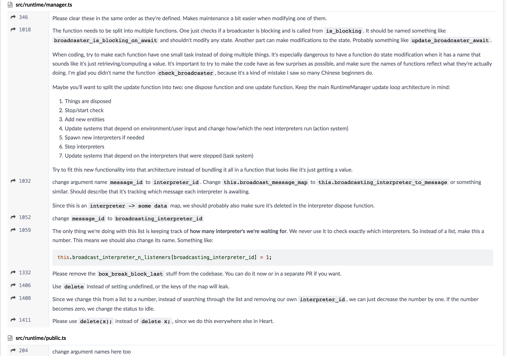

# 从代码结构聊一聊开发效率

最近有个让我挺有感触的事，所以想聊一聊简单感受吧。

我们组的老大是一个瑞典coder，非常酷，头发很长，扎个长辫子，英语说的很好。但是经常神龙不见首尾。heart是他主管的，所以review都得他过。heart这个项目是我工作以来接触到的最有意思的一个项目，项目非常的规范，是typescript写的，es5语法，是我们自己的一个针对图形化编程的编译解释运行器，主要就是编译作品和跑作品，模仿js的编译结构有自己的ast。也有代码检查，报错提示，并且针对了v8引擎做了优化。总之是一个很有意思的项目。

最近做了一个新功能，修改了主要功能以后，这个是他提给我的第一版反馈。

非常的认真，巨细无遗，并且他发给我说'It's lucky that you're writing it instead of me. Good opportunity to teach some things'.

包括命名规范，很多东西很好的命名在维护和理解上都是有很多益处的。还有整个运行的生命周期都有具体的写好告诉我，告诉我为什么要去做拆分，拆分的好处是什么。以及更好的写法也会清晰地提示给我。而不是说你这里不对，你那里不好，又不给原因，让你自己去改。

Oliver平时真的很忙，经常已读不回，找他做一个功能他都没有时间，但他的review真的让人感动。连review都是有排版的！

这是我在heart里添加的第一个完整功能，也是比较大型的review。我第一次提heart的review的时候他也叫我过去给1v1 workshop，告诉我一些代码的规范。他是一个对代码和结构很认真的人。

有人说这是强迫症，我不觉得是强迫症，就应该这样认真的去规范代码和结构。每次新的功能在评审的时候把结构框架理顺了，就能想的全面，bug也会少。

我们经常会讨论编程效率，开发效率。很多都是借助工具，用eslint提示，用bolierplate快速入手，用webpack打包，快捷键，用一些辅助工具帮你排版这类的。这都只是加快了开发的速度而已，都不是关键，多人开发第一要义就是代码规范。

确实每个人有每个人的代码习惯，但是统一的代码规范每个人都可以遵循。这大大降低了维护成本和开发成本。很多时候的重构不一定是项目的结构已经需要改变了，而是多人的代码糅合在一起乱套了，谁也看不出谁在写什么。命名也很随意，这对英语非母语的编程者来说确实比较难，可也不能什么都写update, check呀。名字没有体现好就得写注释，好歹能写中文注释。要是注释也没写好那只能去猜。很多时候项目入手的时候很费劲的一个原因就是要花很多的时间去理解前人的心路历程。遇到一个天马行空的真的崩溃。

同时名字取得好的话就可以不用注释了，这也是Oliver提倡的，很多好的名字是不需要注释的。当然也不是说heart里面没有注释，只是注释量要少很多，只在一些配置项和一些数据结构的地方会有些注释。看heart的代码理解起来非常快，条理也很清晰。

很多时候需求拿到手，脑子里过一下评审就开始动手操作了，完全不管项目的结构，想到一个方法就写一个方法，想用一个方法就随便引用一下。这样的代码堆叠是非常不健康的。从代码上就开始严格规范这才能保证一个项目的健壮性。不管是对个人来说还是团队，这都是很大的收益，不然就等着重构吧。