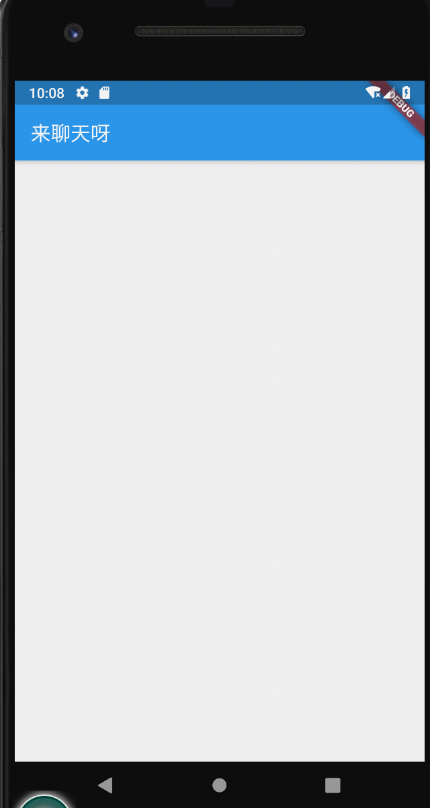

在学习的边缘试探

Flutter最近实在太火了，并且Flutter Web一出震惊四座。可以说是不学不是前端人！Flutter依然是一个正在发展中的框架，一个'Moving Target'，还有很多未来的可能性。

## 关于Flutter

Flutter是一个SDK，基于Dart语言，是一套代码实现各端的并且可以达到原生性能的框架。

## 安装环境

这次先体验Flutter对移动端的支持啦。

首先先安装环境，官网上有很详细的说明。下载安装flutter以后配备一下开发ios和android所需要的环境。其中包括ios所需要的Xcode和android端的Android Studio，主要方便调试。[https://flutter.dev/](https://flutter.dev/)

运行flutter doctor查看一下环境是否都安装正常，然后使用flutter create APP_NAME创建一个新的flutter app，可以看到一个模板的Flutter App，是一个counter小程序。

vscode中安装了flutter插件以后就可以完美地在vscode中编写程序啦，只要打开手机模拟器，更改就会热更新到模拟器上啦，so easy!

## 做一个简单的小程序

### 开始简单的页面

主要跟着code labs上的教程做了一个简单的聊天UI，体验一下Dart和Flutter开发。教程地址如下：[codelabs](https://codelabs.developers.google.com/codelabs/flutter/)

Flutter中一切皆为Widget，包括组件，包括页面。首先创建一个主页面。
```dart
    void main() {
      runApp(
        new MaterialApp(
          title: "Friendlychat",
          home: new Scaffold(
            appBar: new AppBar(
              title: new Text("Friendlychat"),
            ),
          ),
        ),
      );
    }
```
一个简单的主页面就创建成功啦

接下来简单的嵌套一个聊天屏幕
```dart
    class MyApp extends StatelessWidget {
      @override
      Widget build(BuildContext context) {
        return new MaterialApp(
          title: "FriendlyChat",
          home: new ChatScreen(),
        );
      }
    }
    
    class ChatScreen extends StatelessWidget {
      @override
      Widget build(BuildContext context) {
        return new Scaffold(
          appBar: new AppBar(title: new Text("来聊天呀")),
        );
      }
    }
```


### stateful组件

之前创建的都是stateless组件，接下来要创建stateful组件。简单的来说stateless就是没有state的一种固态组件，而stateful组件就是有state可以修改state导致重新渲染的组件。

在stateful组件中，要创建一个自己的State实体，在实体中完成组件的定义。改造后的结构就和下面一样啦。
```dart
    class ChatScreen extends StatefulWidget {
      @override
      State createState() => new ChatScreenState();
    }
    
    class ChatScreenState extends State<ChatScreen> {
      @override
      Widget build(BuildContext context) {
        return new Scaffold(
          appBar: new AppBar(title: new Text("来聊天呀")),
        );
      }
    }
```
接下来就不赘述了（其实本来想把流程贴出来的，但发现也就只是贴贴代码。。）


dart入门确实不难，只要熟悉以下api就可以了，并且官网有很好的开发比对，比如说web开发的css样式和dart的放在一起对比提供给你。学习这些样式布局就很快。

通过这一个小项目的学习差不多就知道布局的逻辑了。我个人的理解就是（非常粗浅），把组件拼接，每一个行每一个列也都是一个组件，组件里面包裹子孩子还有样式，基本的margin，padding也都有。最简单的就是写行和列了，写一个行列，把子组件放到children队列中就可以了。交互逻辑就绑定事件。

Stateful的组件就是拥有state，根据setState可以去重新渲染该部分的组件。不需要重新渲染的就用StatelessWidget。