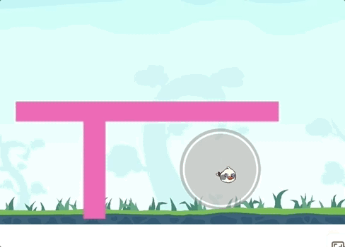

# 从一个bug浅浅地聊一聊matter的碰撞机制

最近在舞台上出了一个物理的bug。物理模型有的时候会穿过其他物体，有的时候又不会。有一个作品是做了类似愤怒的小鸟的效果，结果有的时候穿过桩子了，效果就非常奇怪。



当然matter是没有做持续碰撞检测的（CCD），有的时候速度过快是会导致穿透，而事实上我们的物体速度很慢，还受重力的影响在减速。这就很奇怪了。如下图。

产品和我说这个bug的时候我是非常不愿意的，看起来一个小小的问题，要去看matter的代码，对于我一个物理渣渣来说简直是痛苦。

但，看还是得看。

我首先看了碰撞的环节，发现小鸟和红色的桩没有做碰撞的判断，它们俩叠在一起都那么多部分了，没有道理一直不做检测呀。反观掉落的时候碰撞是完全没有出错的。

那么它是怎么做碰撞判断的呢。它每次碰撞的时候会去获取broadphasePairs，从pairs去做碰撞的检测，碰撞的检测就很算法啦， AABB再SAT，也没有问题，关键就在于这个pairs。那这个pairs又是什么呢。

matter会给整个物理世界划分一个坐标，与其说一个坐标不如说是一个区块图，而区块上的每一个点就是一个bucket，一个区块的高和宽都是定值48。如图所示~

一个region，有相应的坐标，就是这个区块在整个区块图的坐标，也就是说从中心0点开始第一个块就是（0, 1, 0, 1）。所有非静态的物体都会有一个region值，代表了这个物体所覆盖的区块值比如，并且这个物体会存入相应的bucket中，代表这个bucket中存在物体A。每当这个物体所在的region变了，它会重新更新bucket里的值，从旧的bucket中删除，添加到新的bucket中。

而每次添加到bucket中，它会和已有的物体生成一个pair（大概就是我俩在一个区域的意思），每对pair对应了一个数值，代表这两个物体有多少个重合的区块，如果为0，则删除这对pair。每次引擎更新的时候就会去获取到这个pairs然后以此为根据去做检测。源码如下
```javascript
    	Grid._bucketAddBody = function(grid, bucket, body) {
            // add new pairs
            for (var i = 0; i < bucket.length; i++) {
                var bodyB = bucket[i];
    
                if (body.id === bodyB.id || (body.isStatic && bodyB.isStatic))
                    continue;
    
                // keep track of the number of buckets the pair exists in
                // important for Grid.update to work
                var pairId = Pair.id(body, bodyB),
                    pair = grid.pairs[pairId];
    
                if (pair) {
                    pair[2] += 1;
                } else {
                    grid.pairs[pairId] = [body, bodyB, 1];
                }
            }
    
            // add to bodies (after pairs, otherwise pairs with self)
            bucket.push(body);
        };
```
而我们的两个物体确实是有重合区块的，但是为什么会是0，导致不检测呢。我一开始把目光对准了body.bounds。因为物体的region的计算是和bounds有关的，会不会是这个bounds计算错误了呢？
```javascript
    	Bounds.update = function(bounds, vertices, velocity) {
            bounds.min.x = Infinity;
            bounds.max.x = -Infinity;
            bounds.min.y = Infinity;
            bounds.max.y = -Infinity;
    
            for (var i = 0; i < vertices.length; i++) {
                var vertex = vertices[i];
                if (vertex.x > bounds.max.x) bounds.max.x = vertex.x;
                if (vertex.x < bounds.min.x) bounds.min.x = vertex.x;
                if (vertex.y > bounds.max.y) bounds.max.y = vertex.y;
                if (vertex.y < bounds.min.y) bounds.min.y = vertex.y;
            }
    				if (velocity) {
                if (velocity.x > 0) {
                    bounds.max.x += velocity.x;
                } else {
                    bounds.min.x += velocity.x;
                }
                
                if (velocity.y > 0) {
                    bounds.max.y += velocity.y;
                } else {
                    bounds.min.y += velocity.y;
                }
            }
    	}
```
我看了上面的代码发现在物体有速度的时候，它的bounds会变大，但只加大一边的，另一边的却没有变，这个导致了我的怀疑。同时更新物体vertex的时候是会考虑到速度因素的，也就是说bounds是比实际要大一圈的，并且速度的改变导致每一帧的bounds的范围都不一样，这样会导致覆盖的region不一致。但这也不是根本的原因。

然后我发现我们的物体在开始的时候没有生成pair。导致后来每次都进入了新的bucket也从旧的bucket移出，pair几乎都是0（有的时候速度导致bounds的增大，导致pair有的时候大于0，又可以检测到）。再仔细一看，原来我们的物体开始是静止的，然后开始运动，这个时候物体是有region的但是没有被加到bucket中去。

整个逻辑有点绕，就是说小鸟开始的时候被认为是和这个红色物体有例如4个区域重合的，也就是说它们的pair应该为4，然后小鸟进入新的区域后，旧bucket的移除掉，新bucket中添加进来，他们的pair值还是4。直到小鸟和红色物体没有重合bucket了，它们的pair就会变成0。但是，如果两个是静止的，它们俩的pair值一开始就会是0，之后物体进入了新区域，例如有2个进入新区域2个出了旧区域，那一加一减，pair的值还是0。从此它们就不参与物体碰撞啦。

解决的方法就是在把物体设置为动的时候要清空掉body.region，让它重新计算pair。

问题解决了，再去看一看碰撞的机制觉得非常有意思。通过划分区块来存储可能碰到的物体对，然后在检测的时候只需要检测存储好的物体对就可以了。即使是做AABB检测，当一个物体在运动的时候它要去和其他所有的物体做检测也太耗时间了。但是它只需要和它有重合区域的物体做检测，整个性能优化了很多。又有新收获啦。