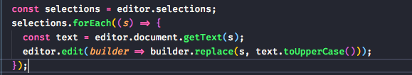
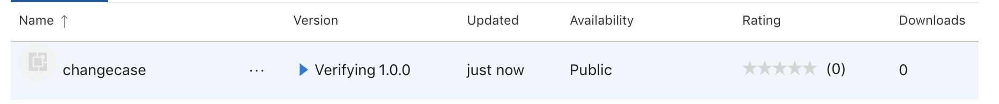

# 从无到有制作一个简单的vscode插件

之前完全没有写过vscode插件，正好觉得有的时候更改大小写有一些麻烦，想写一个选中文字更改大小写的插件，本文谨记录学习过程。

入门的vscode官方有非常详细的视频傻瓜教程，非常方便。

[官网入门教程](https://code.visualstudio.com/api/get-started/your-first-extension)

### 创建环境

先在全局装两个辅助工具

`npm install -g yo`

`npm install -g generator-code`

然后执行`yo code`

vscode提供的generator分为好几种，包括extension, theme, color snippets等等。选择**New Extension (Typescript)**

然后选择一下项目的配置项，后续也可以更改。

不知道为什么yarn装不成功，改用了npm

打开以后就有一个简单的helloworld事例。在extension.ts是主入口，里面注册了一个helloWorld的命令，并且在package.json里面声明。

整个流程比较简单，在extension.ts中注册好命令事件，然后在package.json中声明好等着调用就可以了。按F5就可以开始调试了。

### 代码编写

下面就进行到撰写核心逻辑的部分了。

官方api文档[https://code.visualstudio.com/api/references/vscode-api](https://code.visualstudio.com/api/references/vscode-api)

不过我觉得这个api文档写得有点随意，自己去看了几个插件的编写。主要需要的方法在TextEditor上，通过`vscode.window.activeTextEditor` 获取到正在使用的编辑器，然后找到Selection，Selection会返回当前选中文字的起始位置和结束位置。利用`editor.document.getText()`获取到选中的文字。

看起来很简单，只需要把selections遍历一遍，然后把相应的文字改掉就可以了。

但是失败了，只有第一个选中的会被替换，其他不会。逐个打印了一下，发现是可以获取到的。

查看了一下edit()发现了问题。我们在edit的时候其实已经改变了它的内容，所以我们接下来不能基于已经修改过的内容再次修改，而是把需要修改的内容一次性呈现。（不知道具体的原因，猜测），所以改造后就是把selection和对应的text放到map中去，在edit中遍历这个map把修改完成。

查阅了github issue也是这么推荐操作的。

改进以后功能就正常啦.

现在就要给我的功能添加快捷键啦，在package.json中contributes添加字段keybindings。

快捷键就添加完成啦。

### 打包发布

在打包发布前先写一下项目的README.md和CHANGELOG.md。使用`vsce package` 打包一下，根据提示补充你缺少的参数。

注册microsoft marketplace然后创建publisher然后上传好你打的包就成功啦。会提示你审核，我这个轻量的很快就通过了

应用商店也可以搜索到啦。

### 回顾

写完了发现有很多和我很像的插件，功能也完善很多，说明这个功能还是很必要的嘛哈哈。主要是体验一下vscode插件的开发。总体感觉很好上手，工具很方便，自由度也很高。可以写出很多很方便很有意思的插件，以后再继续探索啦。