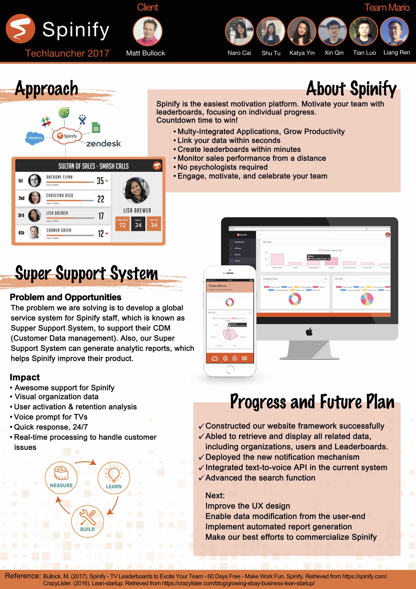

    

<h3><b> Hello there, nice to meet you!</b></h3>

	

	

		
An energetic and creative young female web developer who is able to learn and understand things quickly, inspire the team with ideas from different perspectives. 

		
<b>Love coding. Love badminton. Love life.</b>

	

## Projects

### Android Application on University Activities

It's a mobile application for uni students to publish and view activities. I developed it from a scratch in 2015.   
Since the university is a large community where many activities happen all days hosted by different colleges. Sometimes, students may miss some excellent activities. The aim of this app is to help students learn newest activities happening in school.   
The mechanism of this app is quite similar to eventbrite that students can publish and join the activities via the app.
<embed src='http://player.youku.com/player.php/sid/XMzQ1MzAxNTk1Ng==/v.swf' allowFullScreen='true' quality='high' width='480' height='400' align='middle' allowScriptAccess='always' type='application/x-shockwave-flash'></embed>
 

### Spinify Support System 
#### Spinify
Spinify is a software project aimed to promote and build an engaging, successful work environment. It provides leaderboards for companies based on what is relevant to them. It gamifies these leaderboards, meaning employees can level up and earn achievements due to their work. So far, the software has gotten good reviews at the companies using it http://www.capterra.com/p/155500/Spinify/.
#### Spinify Support System
My role in the project is to develop Spinify Support System (RootSpinify), the administration platform for use by employees at Spinify. They should be able to look up organizations, their users and their leader boards making any administrative adjustments they deem necessary as well as being able to see the progress companies have made and what they focus on.
<iframe height="498" width="510" src="http://tv.sohu.com/upload/static/share/share_play.html#98804622_330392510_0_9001_0" frameborder="0" ></iframe>

 

### Easyway wechat program
#### Personal Project
I have worked for a part-time job in Easyway for almost one year. This little program is a P2P application based on wechat platform. It is used for delivering orders(milk teas) for Easyway milk tea shop(Belconnen Westfield store). Users can order drinks(also can specify types and toppings they want), take and deliver orders for other users and comment on orders.
I used IDE and SDK provided by wechat. Meanwhile, I used SpringBoots and Mybatis to make a local test server.
<iframe height="498" width="510" src="http://player.youku.com/embed/XMzQ1MzAyMjc4OA" frameborder="0" ></iframe>
 

## Design works

	

	

		
	

 

## Education

**2016.2 - 2017.11 Australia National University**   
**Master of Computing, Software Engineering Specialisation**   
**Score Average 70(Distinction)**

**2011.9 - 2015.7. Tianjin Normal University**   
**Computer Science and Technology**   
**Score Average 84**   

 

## About Me

I am a passionate and hard-working person. I like reading, badminton and games.   
Also I am a quick learn who is always eager to learn new technics.   
* Strong programming skills including **Java, C/C++, Android programming, JavaScript, HTML/CSS**.   
* Experience in front-end development using **React.js + Redux**. Excellent in project version control via **GIT**.   
* Experience in **Photoshop**, designed many flyers and posters.   
* Strong **communication** skills through my experience in customer service.   

 

[Contact Me](mailto:narocai@163.com){: .btn}

 
 

Copyright 2018 Naro Cai. Page View: 
  

